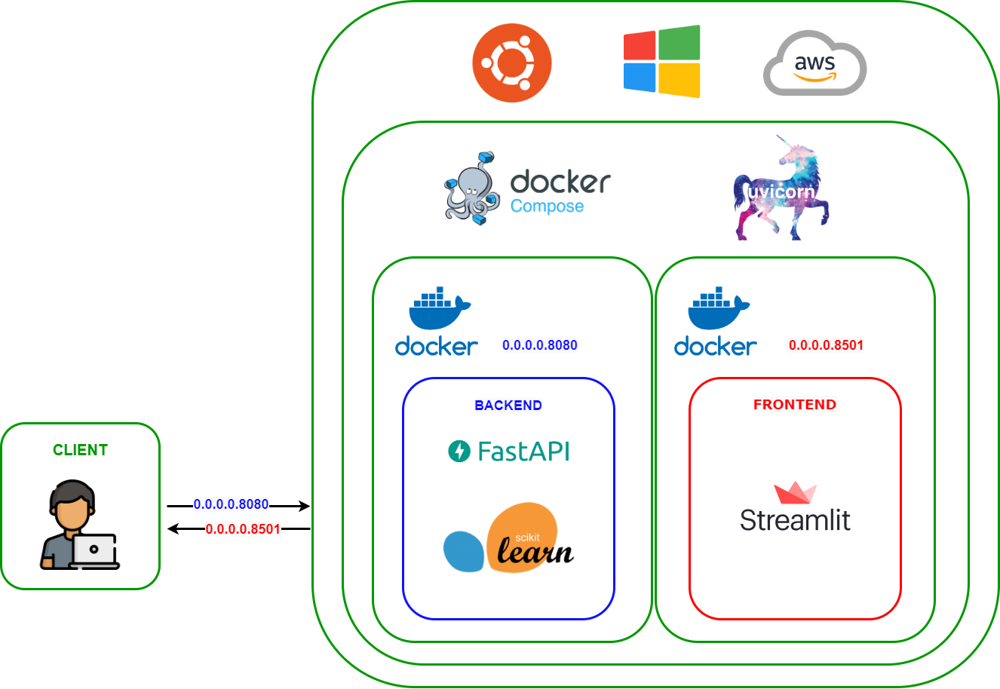

<h1 align="center">Diet Recommendation System</h1> 
  <h4>A web application for personalized diet recommendations using a content-based approach, powered by Scikit-Learn, FastAPI, and Streamlit.</h4> 

📋 Table of Contents
General Info
Development
Technologies
Setup
📝 General Info
Motivation
With rising global awareness of health and lifestyle, a balanced diet is more critical than ever for overall well-being. Combining proper nutrition with physical activity can reduce the risk of chronic diseases and promote better health. Despite the growing importance of dietary habits, there is limited focus on state-of-the-art food recommendation systems. This project introduces a machine-learning-based content-driven diet recommendation system to help users maintain healthier lifestyles.

What is a Food Recommendation Engine?
A food recommendation engine employs a content-based approach to analyze nutritional information and provide personalized food suggestions. It respects dietary restrictions, allergies, and preferences, enhancing the user’s ability to make healthier choices while discovering diverse meal options.

Why a Content-Based Approach?
No user data dependency for recommendations.
Transparency in recommendation logic.
Overcomes the “cold start” problem often faced by collaborative filtering systems.
Highly relevant and personalized suggestions.
Challenges
Limited novelty and diversity in recommendations.
Scalability issues with large datasets.
Potential inconsistencies in attribute data.
💻 Development
Model Development
The recommendation engine uses the Nearest Neighbors algorithm with cosine similarity for computing recommendations. This method provides fast and efficient results for small datasets.

Dataset
The project leverages the Food.com dataset, containing over 500,000 recipes and 1.4 million reviews.

Backend Development
The backend API is developed with FastAPI. User inputs, such as age, weight, and dietary preferences, are processed to generate customized recommendations.

Frontend Development
Streamlit is used to create an intuitive user interface. The application consists of:

A homepage introducing the project.
A diet recommendation page, where users input personal details for customized suggestions.
A custom food recommendation page allowing users to refine their preferences further.
Deployment Using Docker
Docker ensures consistency across environments, simplifying deployment and scaling. Docker Compose enables seamless management of multi-container setups for backend and frontend services.

Project Architecture

  

🚀 Technologies
The project uses:

Python 3.10.8
FastAPI 0.88.0
Uvicorn 0.20.0
Scikit-learn 1.1.3
Pandas 1.5.1
Streamlit 1.16.0
Numpy 1.21.5
BeautifulSoup 4.11.1

🛠 Setup
Run It Locally
Clone the repository:
bash
Copy code
git clone https://github.com/Pavithrabalaji-DA/Diet-Recommendation-System
Use Docker Compose:
bash
Copy code
docker-compose up -d --build
Open http://localhost:8501 to access the app.
Ensure Docker and Docker Compose are pre-installed.

Hosted Version
Try the application on Streamlit Cloud.

📚 Citation
sql
Copy code
@software{pavithrab_2024_12507829,
  author       = {B.Pavithra},
  title        = {Diet Recommendation System},
  month        = jan,
  year         = 2025,
  publisher    = {Zenodo},
  version      = {v1.0.1},
  doi          = {10.5281/zenodo.12507829},
  url          = {https://doi.org/10.5281/zenodo.12507829}
  url          = {https://diet-recommendation-system.streamlit.app/}
}
